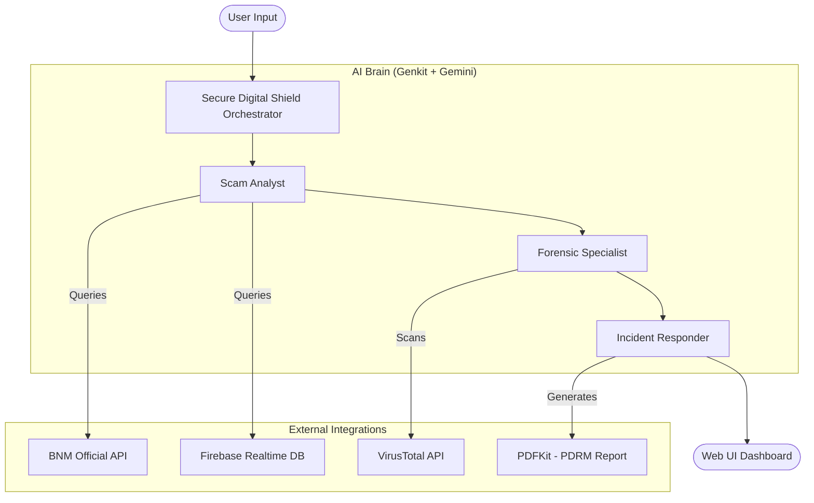

# Secure Digital Shield 🛡️

**Secure Digital Shield** is a premium, multi-agent AI system designed to protect Malaysians from evolving digital scams. By leveraging the power of **Genkit**, **Google Gemini**, and official data sources, it provides real-time analysis, digital forensics, and automated incident response during the "Golden Hour" of a scam.

## 🚀 Key Features

- **Multi-Agent Orchestration**: Three specialized AI agents working in harmony.
- **Official BNM Integration**: Cross-references reports against the Bank Negara Malaysia (BNM) Consumer Alert list.
- **VirusTotal Forensic Scan**: Automatically extracts technical indicators (URLs) and scans them for malicious intent.
- **Firebase Realtime Database**: Stores and checks historical scam data for proactive detection.
- **Automated PDRM Reporting**: Generates a formal police report narrative in Malay and provides a downloadable PDF.
- **Premium Dashboard**: A stunning, modern web interface with real-time progress tracking and glassmorphism aesthetics.

## 🏗️ System Architecture



### The Agents
1.  **Scam Analyst**: The first responder. It identifies patterns, cross-references with official lists (BNM & Firebase), and determines the probability of a scam.
2.  **Forensic Specialist**: Triggered when technical indicators are found. It extracts URLs and technical evidence, performing deep analysis via VirusTotal.
3.  **Incident Responder**: The action agent. It crafts the police report narrative, generates the downloadable PDF, and simulates critical actions like bank notifications.

## 🛠️ Technical Stack

- **Framework**: Genkit (Google's AI Framework)
- **Model**: Google Gemini 2.5 Flash
- **Backend**: Node.js, Express, TypeScript
- **Database**: Firebase Realtime Database
- **Frontend**: Vanilla HTML5, CSS3 (Glassmorphism), JavaScript
- **PDF Generation**: PDFKit

## ⚙️ Setup & Installation

### Prerequisites
- Node.js (v18+)
- Firebase Project
- VirusTotal API Key
- Google AI (Gemini) API Key

### Configuration
Create a `.env` file in the root directory:

```env
GOOGLE_API_KEY="your-google-ai-key"
GOOGLE_APPLICATION_CREDENTIALS="service_account.json"
GOOGLE_CLOUD_PROJECT="your-project-id"
VIRUSTOTAL_API_KEY="your-vt-key"
```

### Installation
1. Install dependencies:
   ```bash
   npm install
   ```

2. Place your Firebase `service_account.json` in the root folder.

3. Start the server:
   ```bash
   npm run server
   ```

## 🖥️ Usage

1. Open `http://localhost:3000` or deployment link below in your browser.
2. Paste a suspicious message, SMS, or narrative into the input field.
3. Click "INITIALIZE ANALYSIS".
4. Watch the AI agents perform the multi-step "Golden Hour" detection.
5. Download the generated PDRM report if a threat is confirmed.

## 🌐 Deployment in Google Cloud Run

Deployment link: https://secure-digital-shield-934974207372.asia-southeast1.run.app

---
Built with ❤️ for the **GDG Hackathon 2026**.
🛡️ *Protecting the Digital Malaysian Frontier.*
