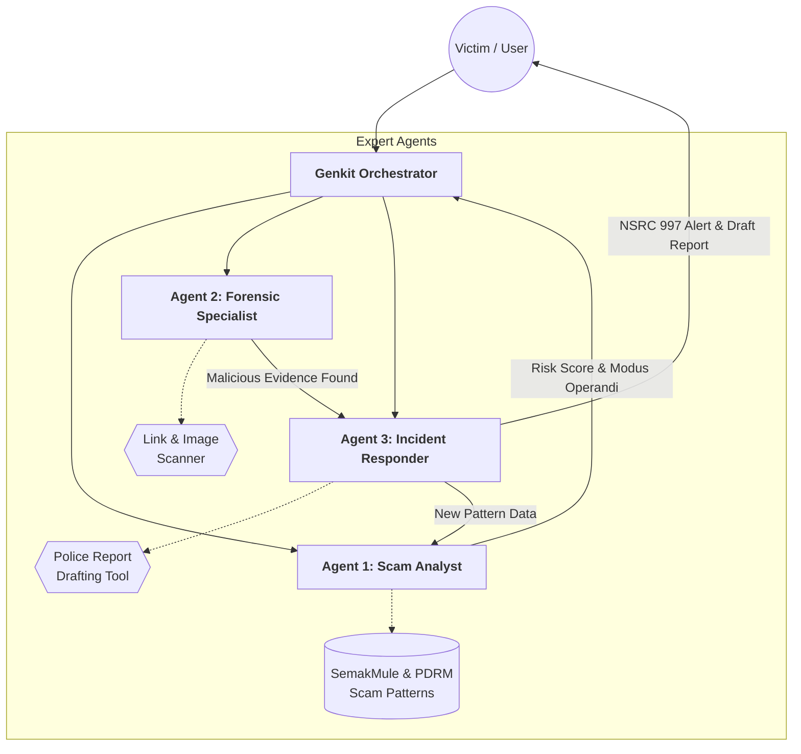

# Secure Digital: A2A Scam Detection & Incident Response

### 🛡️ National Problem Track: Track 5 - Secure Digital
**Team:** [3-in-1 Kopi]  
**Institution:** Universiti Teknologi Malaysia (UTM)

## 📌 Project Overview
Secure Digital is an autonomous, multi-agent AI system designed to protect Malaysians from the rising tide of digital financial fraud. By utilizing an **Agent-to-Agent (A2A)** architecture, the system moves beyond simple detection to provide forensic investigation and immediate legal "Action."

### The Challenge: The "Golden Hour" Crisis
In financial fraud, the first **60 to 120 minutes** is known as the "Golden Hour." This is the critical window where the **National Scam Response Centre (NSRC)** and banks can still intercept and freeze stolen funds. Unfortunately, most Malaysian victims spend these hours in a state of shock or struggle with the manual complexity of reporting, missing the window entirely.

## ⚙️ Technical Architecture
Our solution leverages the **Google AI Stack** to create a seamless "Shield" for the user:

1. 🧠 **Scam Analyst Agent (The Brain):** Uses **Vertex AI Search** grounded in the **SemakMule (PDRM)** database and NSRC modus operandi data.
2. 🔍 **Forensic Agent (The Investigator):** Employs **Genkit Tooling** to scan URLs and uses Gemini’s multimodal vision to analyze screenshots for visual red flags (e.g., fraudulent domains like `cimb-secure-verify.top`).
3. ⚡ **Incident Responder (The Action Taker):** Executes "Autonomous Action" by drafting pre-filled PDRM reports and triggering NSRC 997 alerts.


The system uses an A2A Orchestrator where the Scam Analyst automatically triggers the Forensic Agent upon detecting technical indicators (URLs/Images), passing structured metadata without human intervention. The Incident Responder utilizes Genkit's structured output to generate a localized PDRM report chronology, significantly reducing the 'Golden Hour' response time required by the NSRC. Confirmed scams are fed back into our local MongoDB Atlas pattern database, allowing the Scam Analyst to recognize evolving modus operandi in real-time.

## 🚀 Strategic Impact: Solving the Reporting Bottleneck
Secure Digital isn't just a detection tool; it is a **Response Accelerator** designed to save the Golden Hour:

* **Zero-Latency Documentation:** The **Incident Responder Agent** generates a precise, PDRM-ready chronology in seconds—a task that usually takes victims hours of stressful manual writing.
* **Immediate 997 Trigger:** By verifying scams via the **Forensic Agent** instantly, we can direct users to the NSRC 997 hotline with all necessary evidence (Mule accounts/URLs) ready for the operator.
* **National Resilience:** Every confirmed scam updates our local **MongoDB Atlas** database, creating a crowd-sourced immune system that protects the next user from the same modus operandi.

## 🛠️ Tech Stack
- **AI Model:** Gemini 2.0 Pro / 2.5 Flash
- **Orchestration:** Firebase Genkit
- **Knowledge Base:** Vertex AI Search (RAG)
- **Database:** MongoDB Atlas (Scam Pattern Storage)
- **Forensics:** Google Safe Browsing API / MCMC Blacklist

## 🚀 Getting Started
1. Clone the repo: `git clone https://github.com/lixinneo04/secure-digital-ai.git`
2. Install dependencies: `npm install`
3. Set up your `.env` file (see `.env.example`):
   ```env
   GOOGLE_GENAI_API_KEY=your_api_key_here
   GCP_PROJECT_ID=gdg-hackathon-2026-493002
